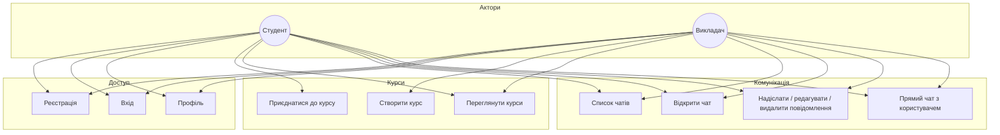

# CampusTalk

## 1. Представлення роботи

### Тема роботи

**«Прогресивна веб-система асинхронної комунікації студентів і викладачів із підтримкою офлайн-доступу»**

### Призначення системи

**CampusTalk** — це вебзастосунок для організації навчальної комунікації в межах університету.

### Яку проблему вирішує система

У багатьох університетах комунікація між студентами та викладачами відбувається через різні сторонні сервіси:

- Telegram, Viber, Discord;
- електронну пошту;
- Google Classroom тощо.

Це створює проблеми:

- інформація розкидана між платформами;
- відсутня єдина система курсів;
- складно контролювати учасників;
- немає інтеграції з академічними групами;
- повідомлення можуть губитися.

CampusTalk вирішує цю проблему шляхом створення **єдиного університетського середовища комунікації** (курси, чати за курсом, прямі повідомлення, профіль користувача).

### Для кого призначена система

Система призначена для:

- **студентів** — перегляд курсів, приєднання до курсів, участь у чатах, пряма переписка;
- **викладачів** — створення та керування курсами, спілкування з групами та окремими студентами;
- **навчальних груп** — підбір учасників за полем групи в профілі студента та за списком груп у курсі;
- **університетського середовища загалом** — як єдиний канал навчальної асинхронної комунікації.

---

## 2. Архітектура системи

### Тип архітектури

Використано **клієнт-серверну архітектуру** з розділенням на:

- односторінковий **прогресивний веб-клієнт (PWA)**;
- **REST API** на Node.js для бізнес-логіки та збереження даних;
- **WebSocket (Socket.io)** для доставки подій у реальному часі (нові/редаговані/видалені повідомлення, індикатор набору тексту, оновлення списку чатів).

### Компоненти та їх взаємодія

| Компонент | Роль |
|-----------|------|
| **Клієнт (React)** | UI, маршрутизація, локальний стан, підключення до API та сокетів, PWA (service worker, кеш, маніфест). |
| **Сервер (Express)** | Маршрути `/api/*`, автентифікація, валідація запитів, робота з БД. |
| **Socket.io** | Той самий HTTP-сервер, що й Express; кімнати за `chatId` для розсилки подій учасникам чату. |
| **MongoDB** | Зберігання користувачів, курсів, чатів і повідомлень (через Mongoose). |

Клієнт звертається до REST для реєстрації, входу, CRUD по курсах, повідомленнях і профілю; паралельно підписується на події сокета після входу в чат (`join-chat`, `send-message` тощо).

### Технології по шарах

**Frontend (`client/`):**

- React 19, TypeScript, Vite;
- React Router 7;
- Zustand — стан;
- UnoCSS — стилі;
- Socket.io client — реальний час;
- **vite-plugin-pwa** + `virtual:pwa-register` — PWA (офлайн-доступ до оболонки застосунку, кеш статики, `navigateFallback` на SPA).

**Backend (`server/`):**

- Node.js, Express 5, TypeScript (запуск через `tsx`);
- Mongoose + MongoDB (у т.ч. Atlas);
- JWT + `bcryptjs` — автентифікація;
- Socket.io — події в чатах.

### Підходи та механізми

- **REST** як основний контракт API (`/api/auth`, `/api/users`, `/api/courses`, `/api/chats`, `/api/messages`).
- **Middleware автентифікації** для захищених маршрутів.
- **ODM Mongoose** — схеми, посилання між колекціями (`ref`), ролі користувача (`student` | `teacher`).
- **Розділення маршрутів** по файлах (`routes/*.routes.ts`).
- **PWA** — встановлюваний додаток і стійкість до коротких збоїв мережі за рахунок кешування shell застосунку (Workbox).

### Структура бази даних (основні сутності)

Колекції відповідають моделям у `server/src/models/`:

**User** — користувач: ПІБ, email, пароль (хеш), роль, опційно `avatarUrl`, академічна **група** (`group`).

**Course** — курс: назва, опис, **викладач** (`teacherId` → User), **студенти** (`studentIds`), **групи** (`groups[]`), зображення.

**Chat** — чат: назва, тип **`course` | `direct`**, опційно **`courseId`** → Course, **`participantIds`** → User.

**Message** — повідомлення: **`chatId`** → Chat, **`authorId`** → User, текст, **`readByIds`**, вкладення (`attachments`: url, name, type).

**Зв’язки (логічно):** User ↔ Course (викладач / студенти); Course → Chat (курсовий чат); User ↔ Chat (учасники); Chat → Message.

---

## 3. Функціональні можливості системи

### Типи користувачів

- **Студент** — приєднання до курсів за групами, чати, прямі діалоги, профіль.
- **Викладач** — створення та редагування курсів, керування учасниками в рамках реалізованої логіки, ті самі канали спілкування.

### Основні функції та сценарії (use cases)

Нижче — логічна карта сценаріїв для діаграми use case (її можна накреслити в UML або FigJam на основі цього списку).



**Підтримувані сценарії роботи:**

1. Реєстрація та вхід з роллю студент/викладач.
2. Оновлення профілю (у т.ч. група для студента).
3. Викладач: створення курсу з описом і групами; студент: перегляд доступних курсів і приєднання.
4. Робота з чатами курсу та прямими чатами; обмін повідомленнями з вкладеннями; відображення оновлень у реальному часі через Socket.io.
5. Захищені сторінки дашборду через маршрутизацію з перевіркою автентифікації.

---

## 4. Демонстрація роботи системи (сценарій для захисту)

**Приклад ланцюжка:**

1. **Реєстрація** викладача та студента (різні ролі, тестові email) → збереження користувача в MongoDB, видача JWT.
2. **Профіль студента** — вказати групу → пояснити зв’язок із відбором курсів за групами.
3. **Викладач** — створити курс з групами → сутність `Course` і прив’язка до `teacherId`.
4. **Студент** — знайти курс, приєднатися → оновлення `studentIds`.
5. **Чат** — відкрити чат курсу, надіслати повідомлення (за наявності — з вкладенням) → збереження через API, доставка іншому клієнту через сокет; згадати `readByIds` за потреби.
6. **Прямий чат** між користувачами — окремий тип `direct`.
7. **PWA** — коротко: встановлення / робота після перезавантаження сторінки, кеш оболонки (не замінює сервер при відправці нових повідомлень без мережі — чесно пояснити межі офлайну).

---

## Tech Stack (коротко)

| Шар | Технології |
|-----|------------|
| Frontend | React, Vite, TypeScript, Zustand, UnoCSS, React Router, Socket.io client, vite-plugin-pwa |
| Backend | Node.js, Express, TypeScript, Mongoose, MongoDB, JWT, bcryptjs, Socket.io |

## Структура репозиторію

- `client/` — frontend (PWA)
- `server/` — backend (REST + WebSocket)

## Запуск

### Frontend

```bash
cd client
npm install
npm run dev
```

### Backend

```bash
cd server
npm install
npm run dev
```
